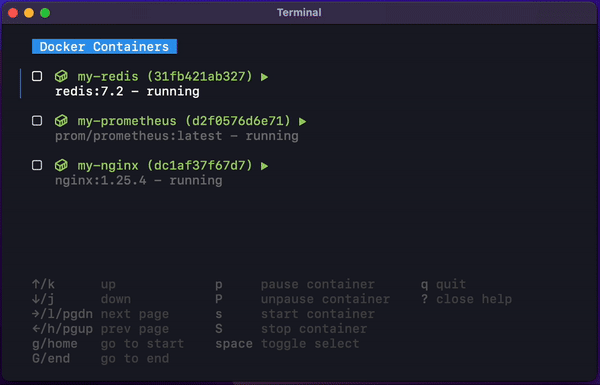

# Laboon

Simple TUI of Docker Desktop written in [Go](https://golang.org/) and [Bubbletea](https://github.com/charmbracelet/bubbletea) 🐳

## Demo



## Requirements

- [Nerd Font](https://www.nerdfonts.com/font-downloads) installed

## Installation

```bash
go install github.com/arisnacg/laboon@latest
```

## Navigation

| Key     | Description                        |
| ------- | ---------------------------------- |
| `s`     | Start current/selected container   |
| `S`     | Stop current/selected container    |
| `p`     | Pause current/selected container   |
| `P`     | Unpause current/selected container |
| `space` | Toggle current/selected container  |
